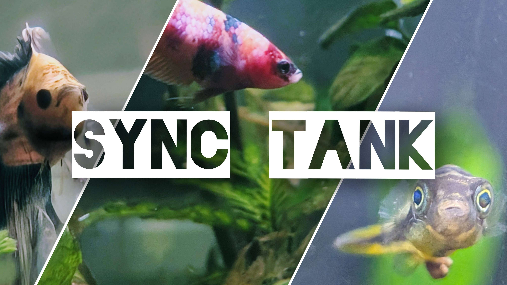
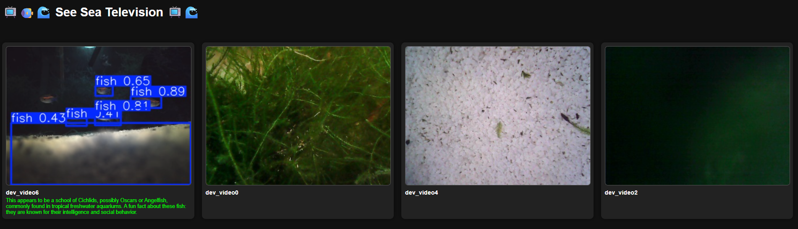
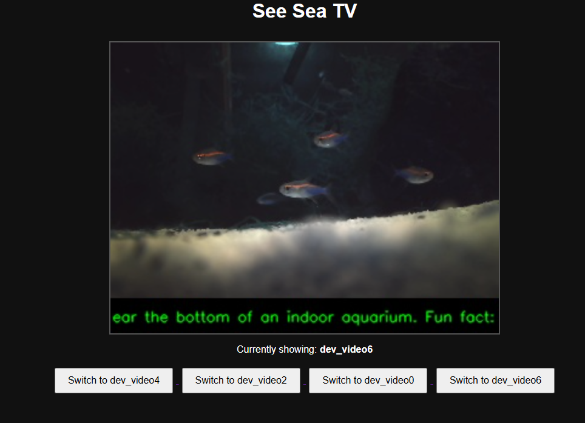

# Sync Tank

**Sync Tank** is an open-source platform for intelligent aquarium monitoring, enrichment, and interaction.  
It combines Raspberry Pi hardware, camera systems, servos, sensors, and server-side AI to give aquarists, hobbyists, and educators a window into the hidden life inside aquatic habitats.

> Water and low voltage have never made this much sense.

---

## What Sync Tank Does

- **Real-time FPV inspection**  
  Watch your aquarium live through FPV goggles, browser interface, or mobile device using Pi Cameras and USB endoscopic cameras.

- **Real-time monitoring and detection**  
  Use computer vision models to detect fish, shrimp, turtles, lizards, or behaviors inside the tank.

- **Interactive enrichment**  
  Control servo-driven arms (REEFLEX) to rearrange the habitat, offer enrichment activities, or deliver feedings.

- **Education and research**  
  Observe population dynamics, interactions, and environmental changes over time; use Sync Tank as a tool in classrooms, hobby setups, or lab research.

---

## Core Components

### SEE SEA TV  
Multi-camera live streaming: Raspberry Pi 5 with PiCamera (extended CSI) and USB endoscopic cameras, outputting to FPV goggles, browser, or local display.

### REEFLEX  
Physical interaction and enrichment: MG995 servo motors controlled through PCA9685 I2C driver board, using 3D-printed tools for habitat adjustment or feeding.

### DEEPLINK  
Computer vision and AI recognition: YOLOv8 object detection models paired with Ollama `llava:7b` multimodal captioning, providing real-time labels and descriptions.

---

## Hardware

- Raspberry Pi 5  
- Pi Camera v3 with extended flex cables  
- USB endoscopic cameras  
- MG995 servo motors with PCA9685 I2C driver  
- Sensor modules: DS18B20 (temperature), ambient light, water level, motion  
- Power: 5V for Pi, 5–7.2V for servos  
- Server PC: AMD CPU, NVIDIA GPU (we used 3080 Ti and 3060 Super)  
- 3D-printed mounts, brackets, and feeder systems (open-source STLs)

---

## What We Used (Open and Transparent)

- **Raspberry Pi 5** at the tank, running Python scripts for live video, sensor capture, and servo control.
- **Ultralytics YOLOv8** models for object detection.
- **Ollama `llava:7b`** for multimodal visual description and captioning.
- **3D-printed REEFLEX parts**, open-source designs for all mounting and feeding hardware.
- **Tailscale** mesh VPN to connect tank devices and remote servers securely over WAN, enabling access even through mobile phones or remote laptops.

---

## Development Pain Points and Lessons

- **Network testing over WAN**  
  Local setups were straightforward, but testing remote control and live video through WAN (wide area network) or mobile networks required extra care. We used Tailscale to create secure, simple tunnels across devices and networks, avoiding complicated port forwarding or VPN configs.

- **Remote + mobile context**  
  We prioritized testing how Sync Tank worked not just on local home networks, but also when accessed remotely — for example, checking tank conditions or controlling enrichment from a mobile phone while away.

- **GPU hardware for AI models**  
  We found that YOLOv8 and `llava:7b` ran adequately on mid- to high-tier consumer GPUs (3060 Super, 3080 Ti) — while technically lighter models exist, for our use case and target performance, these GPUs provided the needed throughput without overkill.

---

## What Sync Tank Enables

- Inspect aquarium habitats live in first person with FPV goggles or browser.
- Count and monitor active animals (fish, shrimp, turtles) in real time.
- Automate or interactively run habitat enrichment and feeding.
- Run time-lapse or continuous monitoring experiments for education or research.
- Provide outreach demos or educational programs showing live underwater ecosystems.
- Expand hobby setups into more automated and intelligent micro-ecosystems.

---

## Open Resources

- YOLOv8 models: https://github.com/ultralytics/ultralytics  
- Ollama `llava:7b`: https://ollama.ai/  
- Raspberry Pi: https://www.raspberrypi.com/  
- PCA9685 Servo Driver: https://www.adafruit.com/product/815  
- Tailscale: https://tailscale.com/  
- 3D Prints (coming soon): check the `3d_prints/` directory

---

## License

MIT License  
We believe in open science, open hardware, and open curiosity.  
Please feel free to fork, improve, remix — and share what you discover.

---

## Acknowledgments

Thanks to the robotics, maker, aquarist, and open-source communities whose tools, ideas, and experiments inspired this project.  
Sync Tank exists because of your groundwork and generosity.
