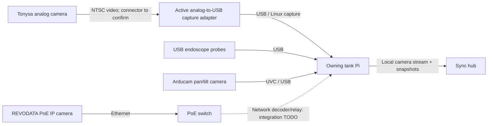
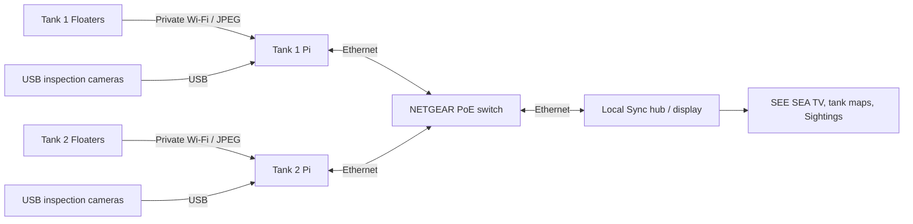
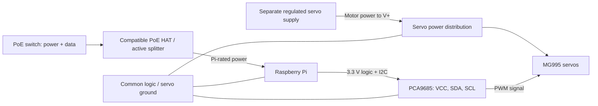

# The electronics workbench

[Website](https://looseleif.github.io/sync-tank/hardware.html) | [Getting started](GETTING_STARTED.md) | [Design origins](DESIGN_ORIGINS.md)

Sync Tank brings ordinary aquarium cameras, Raspberry Pi computers, servo
controllers, and a local Ethernet network together. This is a record of the
project's hardware families, not a claim that every product linked below was
tested. Exact revisions, quantities, supply ratings, and dated measurements
still need to be recorded for a repeatable bill of materials.

## Parts and product references

| Part | Job | Evidence in this project | Product and documentation |
| --- | --- | --- | --- |
| Raspberry Pi tank nodes and display hub | USB cameras, private Floater Wi-Fi, local services and display | Present in deployment guides; exact Pi models not recorded | [Official Pi products](https://www.raspberrypi.com/products/); choose the model and matching power hardware after checking the deployed board |
| PCA9685 servo controller | I2C commands to PWM servo signals | Driver, configuration and assembly photos in this repo; board manufacturer/revision not recorded | [Adafruit PCA9685 reference board](https://www.adafruit.com/product/815), a documented implementation, not a confirmed supplier for our board |
| MG995 servo motors | Mechanical movement of inspection rigs | Reported used and tested by the project owner; exact supplier, positional/continuous variant and measurements not recorded | [TowerPro manufacturer reference](https://towerpro.com.tw/product/mg995-robot-servo-180-rotation/) now describes the MG996R successor; do not use its specifications as a verified MG995 datasheet |
| PoE receiver: compatible HAT or active splitter | Converts Ethernet power to the Pi's required supply | PoE-backed link documented; receiver model and output rating not recorded | [Official Pi PoE HAT](https://www.raspberrypi.com/products/poe-hat/) is specifically for Pi 3 B+ / Pi 4 B; it is not a universal Pi accessory |
| NETGEAR PoE switch | Wired data links and power sourcing for compatible receivers | Reported used and tested by the project owner; model, port allocation and power budget not recorded | [NETGEAR PoE product family](https://www.netgear.com/business/wired/switches/poe/); record the chassis model before selecting a replacement |
| Regulated servo power supply | Supplies motor current separately from Pi logic | Required by the servo-controller wiring; installed supply rating not recorded | [Adafruit servo power guidance](https://learn.adafruit.com/adafruit-16-channel-pwm-servo-hat-for-raspberry-pi/powering-servos); size for the actual motors, wiring and simultaneous load |

Manufacturer links are references, not affiliate links or a verified shopping
cart. MG995 and MG996R are not interchangeable names. Continuous-rotation
variants do not interpret commands as absolute shaft angles.

## Camera inventory and feed paths

The following use history comes from the project owner. Listing descriptions
identify purchases or candidates, not independently measured specifications.
Keep private order links, order numbers and camera credentials out of this repo.

| Camera | Project status and role | Connection to the system | Reference / still needed |
| --- | --- | --- | --- |
| Tonysa Mini CCTV, advertised 170-degree wired NTSC camera | Used for underwater camera positions | Analog video into a USB capture adapter, then the tank Pi | [B08HW881QV](https://www.amazon.com/dp/B08HW881QV); adapter model/chipset, camera power requirements and immersion limits pending |
| REVODATA I704-2-P-HSV6, advertised 5MP, IP65, 3.6 mm, H.265 | Owner reports testing this PoE IP camera; current hub integration not verified | Ethernet/PoE to switch; network decoder/relay needed for hub viewing | [B0DK737JCZ](https://www.amazon.com/dp/B0DK737JCZ); firmware, working stream endpoint, codec profile and test results pending |
| REVODATA I704-P, advertised 5MP, IP65, 3.6 mm | Candidate the owner identified; use or testing not confirmed | Proposed Ethernet/PoE path, not a USB device | [B0B17FHLV6](https://www.amazon.com/dp/B0B17FHLV6); confirm whether acquired and tested |
| Endoscope Camera With Adjustable LED Light, Waterproof Inspection Borescope, 1 Meter Soft Cord | Used as the interior endoscopic cameras | USB to tank Pi, subject to confirming the exact connector and Linux capture mode | No brand/model or product URL supplied; record probe diameter, focus range, cable length, supported video modes and immersion conditions |
| Arducam 4K 8MP IMX219 Autofocus USB Camera Module with Metal Case | Used on the Pi-connected pan/tilt camera rig | Direct UVC USB video to tank Pi | [Matching Arducam B029201 product reference](https://www.arducam.com/arducam-autofoucs-imx219-usb-camera-b029201.html); confirm installed SKU, resolution/FPS and focus behavior |

Arducam's current page offers newer variants as well. Its product title is not
proof of the installed sensor revision, sustained 4K video or its frame rate.
The two REVODATA models are separate records, not interchangeable aliases.
The first two Amazon pages could not be independently read during this pass;
their descriptions above are from the supplied product titles.

### Analog capture is an active conversion

The owner described a component-to-USB connection. For an NTSC camera this is
likely **composite/CVBS** video, commonly on a single yellow RCA connector,
rather than three-channel component video. Confirm the actual connectors and
adapter label before choosing replacements. The USB device digitizes the signal;
a passive cable alone does not perform that conversion. A
[capture-adapter manufacturer's reference](https://media.startech.com/cms/pdfs/svid2usb232_datasheet.pdf)
illustrates the signal distinction, not the installed adapter or a Pi-compatible
replacement recommendation.

The Pi sees the capture adapter, not the Tonysa model. Record its USB identity,
input channel, NTSC/PAL setting and supported V4L2 modes. The camera may need
separate power at its specified voltage; do not assume USB powers it through
the video lead. Wrong input/standard, missing camera power, unsupported modes
or a driver issue can produce a blank feed even when a USB device is listed.

### IP cameras need a network ingest path

A PoE IP camera does not appear as `/dev/video*`. The maintained
[USB capture code](../tank/sync_tank/cameras/usb.py) uses V4L2 and FFmpeg;
the current documentation does not establish a tested REVODATA network adapter.
Confirm the camera's actual RTSP/HTTP/ONVIF capabilities and credentials locally,
then add or verify a decoder/relay that supplies the hub's expected stream and
snapshot contract. Do not guess an RTSP URL or put credentials in public JSON.
H.265 in a listing is not proof that the browser or current hub can decode it.
Record the chosen codec, resolution, FPS, frame age and reconnect behavior.

### Water exposure is a separate qualification

IP65 covers water jets, not immersion. The REVODATA cameras should remain out
of the water unless a separately qualified underwater housing is documented.
Even immersion ratings have manufacturer-specific depth and duration limits;
see the [Axis guide to ingress ratings](https://whitepapers.axis.com/en-us/quick-guide-to-axis-datasheets).
The words "waterproof" in the Tonysa/endoscope titles do not establish continuous
aquarium immersion, saltwater suitability, or waterproof USB connectors.
Owner-reported underwater use is valuable history, not a certified rating.

For the mounting prototype and the follow-up work, see
[underwater camera mounting](CAMERA_MOUNTING.md) and the
[tank development TODOs](TANK_TODO.md).

## Robotic-arm design

Reeflex uses [EEZYbotARM Mk2, published on Autodesk Instructables](https://www.instructables.com/EEZYbotARM-Mk2-3D-Printed-Robot/),
as the mechanical basis for underwater camera inspection and automation
experiments. The linked guide is the upstream design and assembly reference;
the Raspberry Pi, PCA9685, camera integration and motion software described here
belong to the Sync Tank build, not necessarily the original guide's electronics.
See the [source record and creator credit](DESIGN_ORIGINS.md#reeflex--eezybotarm-mk2)
for attribution, model-license tracking and outstanding local modifications.

Underwater inspection does not imply that the entire arm or its servos can be
submerged. Record the actual wet/dry boundary, camera protection and sealing
tests separately. Autonomous inspection remains in development.

## Data path

The switch carries LAN traffic; the tank Pi's Wi-Fi serves its Floaters. Ordinary
local viewing does not require an internet route. USB video and Floater JPEG
snapshots are different media paths. Preserve each camera's owning node and tank.
See [Floater networking](FLOATER_NETWORK.md) for the existing endpoints.

## Power and control are different paths

A bare Pi Ethernet socket does not make it PoE-powered. The PoE receiver must
match the Pi, the switch's supported standard, and the load. Do not connect raw
PoE voltage to GPIO, USB power, the PCA9685, or servos. Record both the switch's
per-port limit and total available budget. A switch model alone may not identify
its installed power adapter's budget. [Pi PoE reference](https://www.raspberrypi.com/products/poe-hat/),
[NETGEAR budget guidance](https://kb.netgear.com/000059496/How-does-the-flexible-Power-over-Ethernet-PoE-budget-work-on-my-NETGEAR-GS108LP-GS108PP-GS116LP-or-GS116PP-switch).

## Raspberry Pi to PCA9685

For a standard 40-pin Pi header and a separate PCA9685 breakout, verify the
board labels and wiring with power off:

| Pi connection | Breakout connection | Purpose |
| --- | --- | --- |
| 3.3 V, physical pin 1 | VCC | Controller logic supply, not motor power |
| GPIO2 / SDA1, physical pin 3 | SDA | I2C data |
| GPIO3 / SCL1, physical pin 5 | SCL | I2C clock |
| GND, physical pin 6 | GND | Common signal reference |
| Separate, correctly rated servo supply | V+ and GND | Motor supply; keep positive power separate from Pi logic |

Check your HAT or splitter's header access before using this table. Adafruit's
[Pi wiring guide](https://learn.adafruit.com/16-channel-pwm-servo-driver/python-circuitpython)
and [servo power guide](https://learn.adafruit.com/16-channel-pwm-servo-driver/hooking-it-up)
explain the VCC / V+ distinction. Do not power the MG995 motor rail from a Pi
GPIO pin. Check servo connector polarity rather than relying only on wire color.

The checked-in [configuration](../tank/config/sync_tank.yaml) uses I2C bus 1,
address `0x40`, and 50 Hz PWM. These are software defaults, not proof of the
installed board address or calibrated servo limits. The node role determines
channel assignments; use the current [tank guide](../tank/README.md) and role
configuration, not an older handoff's channel numbers.

## Bring-up and evidence

1. Record Pi model, controller revision, servo labels/variant, switch model,
   PoE receiver, supply outputs, and photographs of connections.
2. Start with simulated nodes and the [getting-started guide](GETTING_STARTED.md).
3. Keep motor power disconnected during initial installation: the maintained
   tank service can start role-specific motion after a real driver opens.
4. Check I2C detection, correct node role, camera ownership and STOP behavior.
5. With an unloaded mechanism and conservative limits, test one servo at a time.
   Measure supply voltage under motion and simultaneous load before expanding.
6. Log date, exact configuration, duration, result, and failures. Software CI
   does not validate motor current, mechanical clearance, waterproofing, or PoE capacity.

Keep mains supplies, switch, Pi and exposed controller boards dry and outside
the tank. An enclosure or printed part visible in a photo is not evidence that
its material or sealing is suitable for aquarium use.

The missing hardware identifiers and test evidence are tracked in
[the design and build register](DESIGN_ORIGINS.md).
