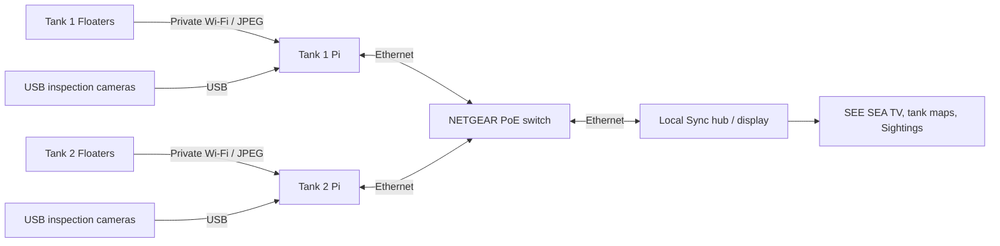
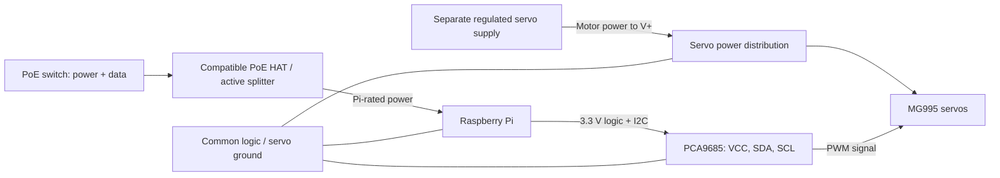

# The electronics workbench

[Website](https://looseleif.github.io/sync-tank/hardware.html) | [Getting started](GETTING_STARTED.md) | [Design origins](DESIGN_ORIGINS.md)

Sync Tank brings ordinary aquarium cameras, Raspberry Pi computers, servo
controllers, and a local Ethernet network together. This is a record of the
project's hardware families, not a claim that every product linked below was
tested. Exact revisions, quantities, supply ratings, and dated measurements
still need to be recorded for a repeatable bill of materials.

## Parts and product references

| Part | Job | Evidence in this project | Product and documentation |
| --- | --- | --- | --- |
| Raspberry Pi tank nodes and display hub | USB cameras, private Floater Wi-Fi, local services and display | Present in deployment guides; exact Pi models not recorded | [Official Pi products](https://www.raspberrypi.com/products/); choose the model and matching power hardware after checking the deployed board |
| PCA9685 servo controller | I2C commands to PWM servo signals | Driver, configuration and assembly photos in this repo; board manufacturer/revision not recorded | [Adafruit PCA9685 reference board](https://www.adafruit.com/product/815), a documented implementation, not a confirmed supplier for our board |
| MG995 servo motors | Mechanical movement of inspection rigs | Reported used and tested by the project owner; exact supplier, positional/continuous variant and measurements not recorded | [TowerPro manufacturer reference](https://towerpro.com.tw/product/mg995-robot-servo-180-rotation/) now describes the MG996R successor; do not use its specifications as a verified MG995 datasheet |
| PoE receiver: compatible HAT or active splitter | Converts Ethernet power to the Pi's required supply | PoE-backed link documented; receiver model and output rating not recorded | [Official Pi PoE HAT](https://www.raspberrypi.com/products/poe-hat/) is specifically for Pi 3 B+ / Pi 4 B; it is not a universal Pi accessory |
| NETGEAR PoE switch | Wired data links and power sourcing for compatible receivers | Reported used and tested by the project owner; model, port allocation and power budget not recorded | [NETGEAR PoE product family](https://www.netgear.com/business/wired/switches/poe/); record the chassis model before selecting a replacement |
| Regulated servo power supply | Supplies motor current separately from Pi logic | Required by the servo-controller wiring; installed supply rating not recorded | [Adafruit servo power guidance](https://learn.adafruit.com/adafruit-16-channel-pwm-servo-hat-for-raspberry-pi/powering-servos); size for the actual motors, wiring and simultaneous load |

Manufacturer links are references, not affiliate links or a verified shopping
cart. MG995 and MG996R are not interchangeable names. Continuous-rotation
variants do not interpret commands as absolute shaft angles.

## Robotic-arm design

Reeflex uses [EEZYbotARM Mk2, published on Autodesk Instructables](https://www.instructables.com/EEZYbotARM-Mk2-3D-Printed-Robot/),
as the mechanical basis for underwater camera inspection and automation
experiments. The linked guide is the upstream design and assembly reference;
the Raspberry Pi, PCA9685, camera integration and motion software described here
belong to the Sync Tank build, not necessarily the original guide's electronics.
See the [source record and creator credit](DESIGN_ORIGINS.md#reeflex--eezybotarm-mk2)
for attribution, model-license tracking and outstanding local modifications.

Underwater inspection does not imply that the entire arm or its servos can be
submerged. Record the actual wet/dry boundary, camera protection and sealing
tests separately. Autonomous inspection remains in development.

## Data path

The switch carries LAN traffic; the tank Pi's Wi-Fi serves its Floaters. Ordinary
local viewing does not require an internet route. USB video and Floater JPEG
snapshots are different media paths. Preserve each camera's owning node and tank.
See [Floater networking](FLOATER_NETWORK.md) for the existing endpoints.

## Power and control are different paths

A bare Pi Ethernet socket does not make it PoE-powered. The PoE receiver must
match the Pi, the switch's supported standard, and the load. Do not connect raw
PoE voltage to GPIO, USB power, the PCA9685, or servos. Record both the switch's
per-port limit and total available budget. A switch model alone may not identify
its installed power adapter's budget. [Pi PoE reference](https://www.raspberrypi.com/products/poe-hat/),
[NETGEAR budget guidance](https://kb.netgear.com/000059496/How-does-the-flexible-Power-over-Ethernet-PoE-budget-work-on-my-NETGEAR-GS108LP-GS108PP-GS116LP-or-GS116PP-switch).

## Raspberry Pi to PCA9685

For a standard 40-pin Pi header and a separate PCA9685 breakout, verify the
board labels and wiring with power off:

| Pi connection | Breakout connection | Purpose |
| --- | --- | --- |
| 3.3 V, physical pin 1 | VCC | Controller logic supply, not motor power |
| GPIO2 / SDA1, physical pin 3 | SDA | I2C data |
| GPIO3 / SCL1, physical pin 5 | SCL | I2C clock |
| GND, physical pin 6 | GND | Common signal reference |
| Separate, correctly rated servo supply | V+ and GND | Motor supply; keep positive power separate from Pi logic |

Check your HAT or splitter's header access before using this table. Adafruit's
[Pi wiring guide](https://learn.adafruit.com/16-channel-pwm-servo-driver/python-circuitpython)
and [servo power guide](https://learn.adafruit.com/16-channel-pwm-servo-driver/hooking-it-up)
explain the VCC / V+ distinction. Do not power the MG995 motor rail from a Pi
GPIO pin. Check servo connector polarity rather than relying only on wire color.

The checked-in [configuration](../tank/config/sync_tank.yaml) uses I2C bus 1,
address `0x40`, and 50 Hz PWM. These are software defaults, not proof of the
installed board address or calibrated servo limits. The node role determines
channel assignments; use the current [tank guide](../tank/README.md) and role
configuration, not an older handoff's channel numbers.

## Bring-up and evidence

1. Record Pi model, controller revision, servo labels/variant, switch model,
   PoE receiver, supply outputs, and photographs of connections.
2. Start with simulated nodes and the [getting-started guide](GETTING_STARTED.md).
3. Keep motor power disconnected during initial installation: the maintained
   tank service can start role-specific motion after a real driver opens.
4. Check I2C detection, correct node role, camera ownership and STOP behavior.
5. With an unloaded mechanism and conservative limits, test one servo at a time.
   Measure supply voltage under motion and simultaneous load before expanding.
6. Log date, exact configuration, duration, result, and failures. Software CI
   does not validate motor current, mechanical clearance, waterproofing, or PoE capacity.

Keep mains supplies, switch, Pi and exposed controller boards dry and outside
the tank. An enclosure or printed part visible in a photo is not evidence that
its material or sealing is suitable for aquarium use.

The missing hardware identifiers and test evidence are tracked in
[the design and build register](DESIGN_ORIGINS.md).
